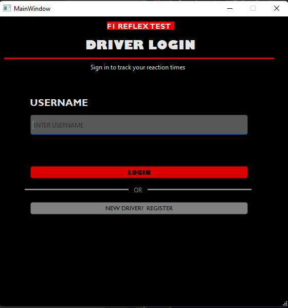
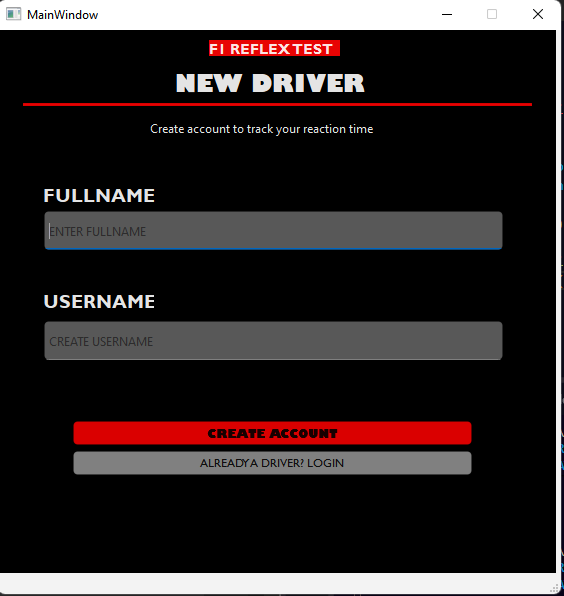

# F1 REFLEX TEST — Reaction-Time Trainer with Leaderboard
## Project Description


F1 REFLEX TEST is a **desktop reaction-time trainer** inspired by Formula 1's start-light sequence. The application simulates five red lights that turn on one at a time, then go out after a randomized delay. The player must react as quickly as possible once the lights go out, and the system measures the reaction time in milliseconds, assigns a driver rating, and stores the result in a **SQLite database**.

Most reaction-time tests are browser-based, require internet access, and do not save results. F1 REFLEX TEST provides a fully offline desktop alternative that tracks every attempt, ranks the fastest reactions on a top-10 leaderboard, and lets players compare their best times over multiple sessions.

---

## Project Objectives

The main objectives of F1 REFLEX TEST are to:

- Develop a Python-based desktop application that measures visual reaction time.
- Simulate the F1 start-light sequence with a randomized GO signal.
- Measure reaction time to the nearest millisecond.
- Detect and penalize jump starts (reacting before the GO signal).
- Assign a driver rating based on reaction speed.
- Implement Create, Read, Update, and Delete operations for scores.
- Provide a user-friendly graphical interface using PyQt6.
- Apply object-oriented programming through PyQt6 window classes and inheritance.
- Provide a persistent leaderboard of the top-10 fastest reactions.

---

## Features

- **User Registration** — Create an account with a full name and unique username. The system validates required fields and prevents duplicate usernames.
- **Login** — Access the application by entering a registered username.
- **Start Menu** — Central hub for login, the game, and the leaderboard.
- **Lights Sequence** — Five red lights turn on one at a time, 800 ms apart, simulating the F1 race start.
- **Randomized GO Signal** — A random delay of 1 to 3 seconds after the last light. The player must react the moment the lights go out.
- **Reaction Measurement** — The exact elapsed time from GO to key press is measured in milliseconds.
- **Jump Start Detection** — Reacting before the GO signal ends the round with a penalty and saves the session as invalid.
- **Rating System** — Each valid reaction is assigned a rating based on speed.
- **Leaderboard** — Displays the top-10 fastest valid reactions with rank, rating, name, time, and date.
- **Persistent Storage** — All accounts, sessions, and scores survive app restarts via SQLite.

### Rating Tiers

| Reaction Time | Rating |
| :---: | --- |
| `< 150 ms` | F1 Racer |
| `150 – 199 ms` | F2 Racer |
| `200 – 249 ms` | F3 Racer |
| `250 – 349 ms` | Karting Racer |
| `≥ 350 ms` | Normal Driver, Slow |

---

## Technologies Used

- **Programming Language:** Python 3
- **GUI Framework:** PyQt6
- **GUI Layout Tool:** Qt Designer (`.ui` files)
- **Database:** SQLite
- **Python Standard Libraries:** `sqlite3`, `datetime`, `time`, `random`
- **GUI Styling:** Qt Style Sheets (QSS)
- **Version Control:** Git and GitHub

---

## Project Structure

```text
f1-reflex-test/
│
├── main.py
├── f1_reflex.db
├── README.md
├── .gitignore
│
├── database/
│   ├── __init__.py
│   └── database.py
│
├── features/
│   ├── __init__.py
│   ├── auth.py
│   ├── game.py
│   └── leaderboard.py
│
├── gui/
│   ├── __init__.py
│   ├── start_menu.py
│   ├── login_page.py
│   ├── register_page.py
│   ├── lights_window.py
│   └── leaderboard_window.py
│
├── ui_designs/
│   ├── F1_1stUI.ui
│   ├── login_page_ui.ui
│   ├── driver_page_ui.ui
│   └── leaderboard_ui.ui
│
└── screenshots/
    ├── start_menu.png
    ├── driver_login.png
    ├── driver_register.png
    ├── lights_game.png
    ├── go_signal.png
    ├── jumpstart.png
    └── leaderboard.png
```

### Folder and File Descriptions

- `main.py` – Starts the F1 REFLEX TEST application and launches the PyQt6 main window.
- `database/__init__.py` – Creates the shared `DB` instance and initializes the database on first launch.
- `database/database.py` – Handles the SQLite connection and all CRUD operations for players, sessions, reactions, and the leaderboard.
- `features/auth.py` – Contains login and registration logic.
- `features/game.py` – Contains the rating calculation and score-saving logic.
- `features/leaderboard.py` – Retrieves the top-10 leaderboard rows.
- `gui/` – Contains the PyQt6 graphical interface for the start menu, login, registration, the lights game, and the leaderboard.
- `ui_designs/` – Contains the Qt Designer `.ui` files that define the visual layout of each screen.

---

## Installation and Setup

### Requirements

Before running F1 REFLEX TEST, install:

- Python 3.10 or higher
- PyQt6
- Git

### Step 1 — Clone or Download the Repository

Clone the GitHub repository:

```bash
git clone https://github.com/YOUR-USERNAME/f1-reflex-test.git
```

Then enter the project directory:

```bash
cd f1-reflex-test
```

### Step 2 — Create a Virtual Environment

Creating a virtual environment is recommended.

```bash
python -m venv myappvenv
```

Activate it on Windows PowerShell:

```powershell
.\myappvenv\Scripts\Activate.ps1
```

On macOS / Linux:

```bash
source myappvenv/bin/activate
```

### Step 3 — Install Dependencies

Install the required Python libraries:

```bash
pip install PyQt6
```

### Step 4 — Run the Application

Run:

```bash
python main.py
```

The database file `f1_reflex.db` is created automatically on first launch. No manual database setup is required.

---

## How to Use the System

1. Open the application by running `main.py`.
2. On the Start Menu, click **START**. If not logged in, you are redirected to the Login page.
3. Click **REGISTER** to create a new account. Enter your full name and desired username.
4. Return to the login page and log in with your username.
5. Click **START** again to open the **Lights Game**.
6. Watch the five red lights turn on one at a time.
7. Wait for the **"GO GO GO!"** signal — the moment the lights go out.
8. Press **SPACE** or click **REACT** as fast as you can.
9. Your reaction time and rating appear on screen. The result is saved automatically.
10. Click the **←** arrow at the top-left to return to the Start Menu.
11. Click **LEADERBOARD** to view the top-10 fastest reactions.
12. Click **BACK TO START** on the leaderboard to return.

> **Note:** Pressing SPACE before the GO signal counts as a **jump start**. The round ends with a penalty, and the session is saved as "Jump Start."

---

## OOP Implementation

F1 REFLEX TEST uses classes to organize the graphical interface and the application logic.

Important classes:

- `Database` – Handles all SQLite operations including table creation and every CRUD method.
- `StartMenu` – The main navigation hub that holds the current user and switches between screens.
- `LoginPage` – The login screen.
- `RegistrationPage` – The account-creation screen.
- `LightsWindow` – The lights game with timers and reaction handling.
- `Leaderboard` – Displays the top-10 fastest reactions.

### Encapsulation

Encapsulation is applied by grouping related data and behavior into classes. The `Database` class hides every SQL query behind simple methods like `create_player()`, `save_reaction()`, and `get_leaderboard()`. GUI files and feature modules never touch SQL directly — they call methods on the `DB` object. If the storage engine were replaced, only `database.py` would need to change.

### Inheritance

Inheritance is used mainly through PyQt6. Every screen class inherits from a PyQt widget:

```python
class StartMenu(QMainWindow):
    def __init__(self, app):
        super().__init__()     # calls QMainWindow's constructor
```

`StartMenu`, `LoginPage`, `RegistrationPage`, and `LightsWindow` all inherit from `QMainWindow`. `Leaderboard` inherits from `QWidget`. This gives each screen built-in support for windows, resizing, title bars, and event handling without re-implementing them.

### Polymorphism

`LightsWindow` overrides `keyPressEvent()`, which is inherited from `QWidget`. Qt calls our version to handle the SPACE key, while other keys fall through to the parent class.

```python
def keyPressEvent(self, event):
    if event.key() == Qt.Key.Key_Space:
        self.handle_react()
    else:
        super().keyPressEvent(event)
```

### Objects and Instances

Each screen file creates instances of the classes at runtime:

- `StartMenu(app)` creates one menu object
- `LightsWindow(self)` creates a new game window each time the player starts
- `Database("f1_reflex.db")` creates a single shared database object inside `database/__init__.py`

---

## Database

F1 REFLEX TEST uses a SQLite database named `f1_reflex.db`. Four normalized tables are used.

### player Table

The `player` table stores:

- `player_id` – Unique player ID generated automatically by the database.
- `fullname` – The player's full name.
- `username` – The player's unique username.

### game_sessions Table

The `game_sessions` table stores:

- `session_id` – Unique session ID generated automatically by the database.
- `player_id` – Foreign key to the player who played the round.
- `session_date` – Date the session was played.
- `session_time` – Time the session was played.
- `result` – Either `'Valid'` or `'Jump Start'`.

### reaction_time Table

The `reaction_time` table stores:

- `reaction_id` – Unique reaction ID generated automatically by the database.
- `session_id` – Foreign key to the parent session.
- `player_id` – Foreign key to the player.
- `reaction_time` – The measured reaction time in milliseconds.
- `rating` – The rating tier assigned to the reaction.

### leaderboard Table

The `leaderboard` table stores:

- `leaderboard_id` – Unique leaderboard row ID generated automatically.
- `player_id` – Foreign key to the player.
- `rank` – Position 1 through 10.
- `date_achieved` – The date the score was set.

### Relationship Summary

```
PLAYER ──1:M──> GAME_SESSIONS ──1:M──> REACTION_TIME
   │
   └──1:M──> LEADERBOARD
```

All foreign keys use `ON DELETE CASCADE` — deleting a player removes their sessions, reactions, and leaderboard rows automatically. Foreign key enforcement is enabled with `PRAGMA foreign_keys = ON`.

### Database Operations

The system performs the following main operations:

- **Create** – Add new players, sessions, and reactions.
- **Read** – Find a player by username, and retrieve the top-10 leaderboard rows.
- **Update** – Refresh the leaderboard after each valid reaction.
- **Delete** – Implicitly remove old leaderboard rows when the top-10 is rebuilt.

All queries use **parameterized placeholders (`?`)** to prevent SQL injection.

---

## Screenshots

### Start Menu


- Shows the main F1 REFLEX TEST interface. Users can start the game or open the leaderboard.

### Login Screen


- Users enter their username. New users can navigate to the registration page.

### Registration Screen


- Creates a new player account with a full name and unique username.

### Lights Game


- Five red lights turn on one by one. The player must wait for the GO signal.

### GO Signal


- All lights off — the player must react immediately.

### Jump Start Penalty


- The player reacted too early. The round ends with a penalty.

### Leaderboard


- Displays the top-10 fastest valid reactions with rank, rating, name, time, and date.

---

## Testing

The system was tested by performing the major operations available in F1 REFLEX TEST.

| Test Case | Expected Result | Actual Result |
| --- | --- | --- |
| Launch the application | The Start Menu appears. | Passed |
| Register a new username | Account is created and saved to the database. | Passed |
| Register a duplicate username | The system displays "Username already exists". | Passed |
| Register with empty fields | The system displays "Fill in all fields". | Passed |
| Login with a valid username | Redirect to the Start Menu. | Passed |
| Login with an unknown username | The system displays "Username not found". | Passed |
| Play a valid round | Reaction time and rating are shown and saved. | Passed |
| React before GO | The system shows "JUMP START" and saves an invalid session. | Passed |
| Open the leaderboard | Top-10 records with rating are displayed. | Passed |
| Click the ← arrow | Returns to the Start Menu without errors. | Passed |
| Delete `f1_reflex.db` and relaunch | The database is recreated automatically. | Passed |
| Verify data persistence | Scores remain after restarting the application. | Passed |

---

## Known Issues / Limitations

1. **No Password Authentication**
   Login only checks the username. Passwords are not used in the current version — a simplified flow requested for the prototype.

2. **No Logout Button**
   Users must restart the application to switch accounts.

3. **Leaderboard Does Not Auto-Refresh**
   The leaderboard rebuilds when it is opened, but it does not live-update while visible.

4. **No Individual Score Deletion**
   Players cannot remove their own entries from the leaderboard.

5. **Local Database Only**
   The SQLite database is stored locally on the computer running the application. Records are not synchronized between different computers.

---

## Author

**Name:** Paolo Miguel C. Plasabas

**Section:** CS26L — 3581
