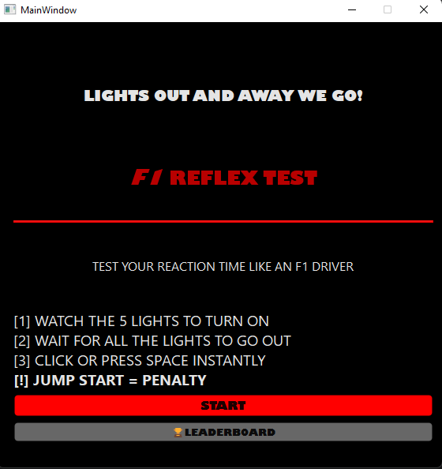
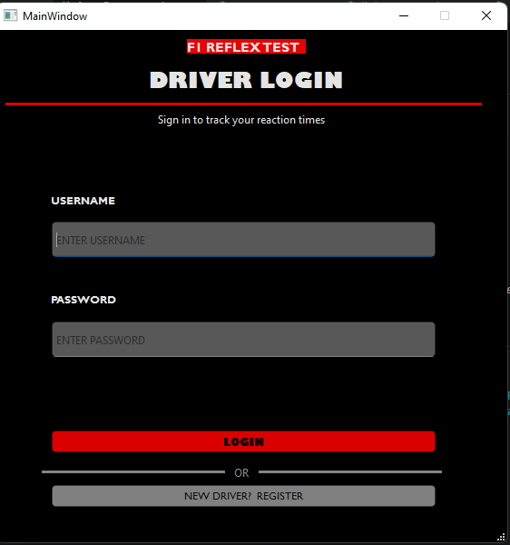
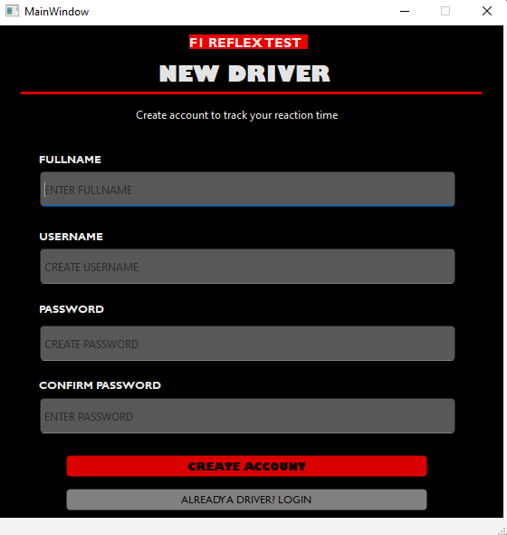
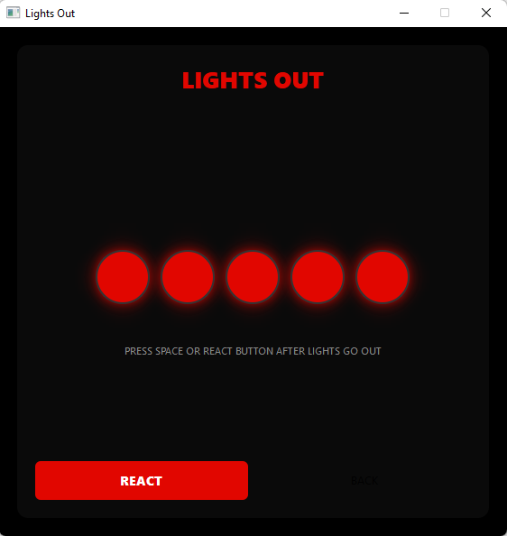
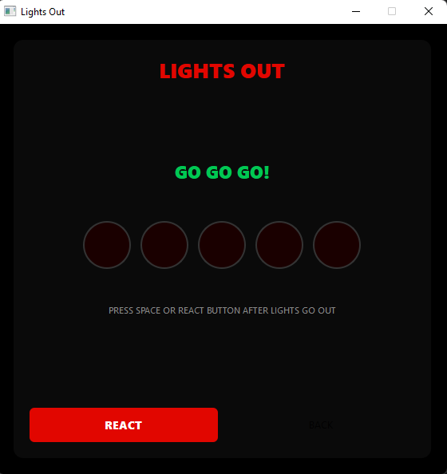
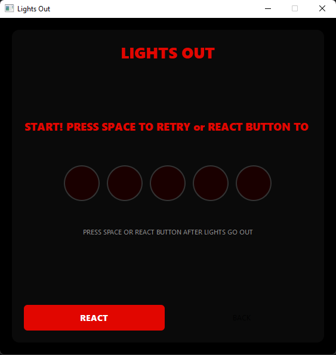
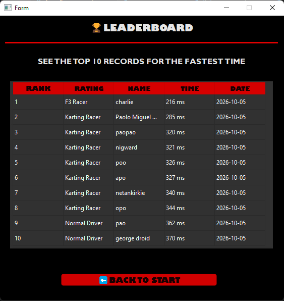

# F1 Reflex Test

**CS26 - SOFTWARE DEVELOPMENT | 3rd Written Examination**

A desktop reaction-time trainer inspired by Formula 1's start-light sequence.
Built with **Python**, **PyQt6**, and **SQLite**.


---

## 1. Project Title

**F1 Reflex Test** — A Desktop Reaction-Time Trainer Using PyQt6 and SQLite

---

## 2. Project Description
The F1 Reflex Test is a desktop application that measures a user's reaction time through an interactive sequence inspired by Formula 1's start lights. Five red lights turn on one at a time, then go out after a randomized delay. The player must react as quickly as possible once the lights go out, and their reaction time is measured in milliseconds.

**Problem it addresses:** Most reaction-time tests are browser-based, require internet access, and do not store results. There is no simple offline desktop tool that simulates the visual tension of a real F1 start while also tracking a player's performance over time.

**Who it is for:** Students, gamers, motorsports fans, and anyone interested in measuring or training their visual reaction speed.

---

## 3. Project Objectives

### General Objective

To develop a desktop application that simulates the F1 start-light sequence, measures reaction time accurately, and stores results for performance tracking.

### Specific Objectives

- Provide user registration and login
- Simulate a 5-light F1 start sequence with an unpredictable GO signal
- Measure reaction time to the nearest millisecond
- Detect and penalize jump starts (reacting before GO)
- Assign a driver rating based on reaction speed
- Store all sessions and reaction times in a database
- Display a top-10 leaderboard of the fastest valid reactions
- Allow navigation between screens without restarting the app

---

## 4. Features

| Feature | Description |
|---|---|
| **User Registration** | Create an account with full name, username, and password. Usernames are unique. |
| **Login** | Authenticate against the database. Sessions are tracked per user. |
| **Start Menu** | Central hub that navigates to login, the game, or the leaderboard. |
| **Lights Game** | Five red lights turn on one by one every 800 ms. |
| **Randomized GO Signal** | After all five lights are on, a random delay of 1–3 seconds triggers the GO signal. |
| **Reaction Measurement** | SPACE key or REACT button records the elapsed milliseconds. |
| **Jump Start Detection** | Reacting before GO ends the round with a penalty message. |
| **Rating System** | Each valid reaction is assigned a rating from *F1 Racer* to *Normal Driver, Slow*. |
| **Leaderboard** | Displays the top-10 fastest valid reactions with rank, name, time, rating, and date. |
| **Persistent Storage** | All accounts, sessions, and scores survive app restarts via SQLite. |

### Rating Tiers

| Reaction Time | Rating |
|:---:|---|
| `< 150 ms` | F1 Racer |
| `150 – 199 ms` | F2 Racer |
| `200 – 249 ms` | F3 Racer |
| `250 – 349 ms` | Karting Racer |
| `≥ 350 ms` | Normal Driver, Slow |

---

## 5. Technologies Used

| Component | Technology |
|---|---|
| **Programming Language** | Python 3.10+ |
| **GUI Framework** | PyQt6 (with Qt Designer for `.ui` layout files) |
| **Database** | SQLite 3 (built into Python's standard library) |
| **Other Libraries** | `time`, `random`, `datetime`, `sqlite3` |
| **Development Tool** | Visual Studio Code |

---

## 6. Project Structure

```
f1-reflex-test/
│
├── main.py                       # Entry point — launches the application
├── f1_reflex.db                  # SQLite database (auto-created on first run)
├── README.md
├── .gitignore
│
├── database/
│   ├── __init__.py               # Creates the shared DB instance
│   └── database.py               # Database class — schema + all CRUD methods
│
├── gui/
│   ├── __init__.py
│   ├── start_menu.py             # Navigation hub
│   ├── login_page.py             # Login screen
│   ├── driver_register_page.py   # Registration screen
│   ├── lights_menu_ui.py         # The lights game
│   └── leaderboard.py            # Leaderboard display
│
├── ui_designs/
│   ├── F1_1stUI.ui               # Start menu layout
│   ├── login_page_ui.ui          # Login layout
│   ├── driver_page_ui.ui         # Registration layout
│   └── leaderboard_ui.ui         # Leaderboard layout
│
└── screenshots/
    ├── start_menu.png
    ├── login.png
    ├── register.png
    ├── lights_game.png
    ├── go_signal.png
    ├── jump_start.png
    └── leaderboard.png
```

### Purpose of each major file

| File | Purpose |
|---|---|
| `main.py` | Creates the `QApplication` and launches the `StartMenu` window |
| `database/database.py` | Contains the `Database` class with table creation and all CRUD operations |
| `gui/start_menu.py` | Holds the reference to the current user and switches between screens |
| `gui/lights_menu_ui.py` | Contains the game loop, timers, and reaction logic |
| `gui/leaderboard.py` | Loads and displays the top-10 from the database |

---

## 7. Installation and Setup

### Requirements

- Python 3.10 or higher
- PyQt6
- Git

### Steps

**1. Clone the repository**

```bash
git clone https://github.com/YOUR-USERNAME/f1-reflex-test.git
cd f1-reflex-test
```

**2. Create a virtual environment**

```bash
python -m venv myappvenv
```

**3. Activate the virtual environment**

Windows PowerShell:
```powershell
.\myappvenv\Scripts\Activate.ps1
```

macOS / Linux:
```bash
source myappvenv/bin/activate
```

**4. Install dependencies**

```bash
pip install PyQt6
```

**5. Run the application**

```bash
python main.py
```

The database file `f1_reflex.db` is created automatically on first launch.

---

## 8. How to Use the System

1. Launch the application — the **Start Menu** appears.
2. Click **START** — you are redirected to the **Login page**.
3. Click **REGISTER** to create a new account. Enter your full name, username, password, and confirm password.
4. Return to the login screen and log in with your new credentials.
5. Click **START** again — the **Lights Game** opens.
6. Watch the five red lights turn on one at a time.
7. Wait for all lights to go out and the **"GO GO GO!"** signal to appear.
8. Press **SPACE** or click **REACT** as fast as you can.
9. Your reaction time and rating appear on screen.
10. Click **BACK** to return to the start menu.
11. Click **LEADERBOARD** to view the top-10 fastest reactions.
12. Click **BACK TO START** on the leaderboard to return.

> **Note:** Pressing SPACE before the GO signal counts as a **jump start**. The round ends with a penalty and the session is saved as "Jump Start."

---

## 9. OOP Implementation

### Important Classes

| Class | Inherits From | Purpose |
|---|---|---|
| `Database` | *(none)* | Handles all database operations |
| `StartMenu` | `QMainWindow` | Navigation hub |
| `LoginPage` | `QMainWindow` | Login screen |
| `RegistrationPage` | `QMainWindow` | Registration screen |
| `LightsWindow` | `QMainWindow` | The lights game |
| `Leaderboard` | `QWidget` | Leaderboard display |

### Encapsulation

The `Database` class encapsulates every database operation. GUI files call methods like `DB.login_player()` and `DB.get_leaderboard()` — they never touch SQL directly. If the storage engine were replaced, only `database.py` would need to change.

### Inheritance

Every screen class inherits from a PyQt widget class (`QMainWindow` or `QWidget`). This gives each screen built-in support for windows, resizing, title bars, and event handling without re-implementing them.

```python
class StartMenu(QMainWindow):
    def __init__(self, app):
        super().__init__()     # calls QMainWindow's constructor
```

### Polymorphism

`LightsWindow` overrides `keyPressEvent()`, which is inherited from `QWidget`. Qt calls our version to handle SPACE, while other keys fall through to the parent class.

```python
def keyPressEvent(self, event):
    if event.key() == Qt.Key.Key_Space:
        self.handle_react()
    else:
        super().keyPressEvent(event)
```

### Objects and Instances

Each screen file creates instances of the classes at runtime:

- `StartMenu(app)` creates one menu object
- `LightsWindow(self)` creates a new game window each time the player starts
- `Database("f1_reflex.db")` creates a single shared database object inside `database/__init__.py`

---

## 10. Database

### Database Structure

The project uses **SQLite 3**, stored in a single file `f1_reflex.db`. Four normalized tables are used.

#### `player`
| Column | Type | Constraint |
|---|---|---|
| player_id | INTEGER | PRIMARY KEY AUTOINCREMENT |
| fullname | VARCHAR(50) | NOT NULL |
| username | VARCHAR(50) | NOT NULL, UNIQUE |
| password | VARCHAR(50) | NOT NULL |

#### `game_sessions`
| Column | Type | Constraint |
|---|---|---|
| session_id | INTEGER | PRIMARY KEY AUTOINCREMENT |
| player_id | INTEGER | FOREIGN KEY → player |
| session_date | DATE | |
| session_time | TIME | |
| result | VARCHAR(50) | CHECK IN ('Valid', 'Jump Start') |

#### `reaction_time`
| Column | Type | Constraint |
|---|---|---|
| reaction_id | INTEGER | PRIMARY KEY AUTOINCREMENT |
| session_id | INTEGER | FOREIGN KEY → game_sessions |
| player_id | INTEGER | FOREIGN KEY → player |
| reaction_time | DECIMAL(11,2) | milliseconds |
| rating | VARCHAR(50) | |

#### `leaderboard`
| Column | Type | Constraint |
|---|---|---|
| leaderboard_id | INTEGER | PRIMARY KEY AUTOINCREMENT |
| player_id | INTEGER | FOREIGN KEY → player |
| rank | INTEGER | |
| date_achieved | DATE | |

### Relationship Summary

```
PLAYER ──1:M──> GAME_SESSIONS ──1:M──> REACTION_TIME
   │
   └──1:M──> LEADERBOARD
```

All foreign keys use `ON DELETE CASCADE` — deleting a player removes their sessions, reactions, and leaderboard rows automatically. Foreign key enforcement is enabled with `PRAGMA foreign_keys = ON`.

### Database Operations

| Operation | Method | SQL Command |
|---|---|---|
| **Create (player)** | `DB.create_player()` | `INSERT INTO player ...` |
| **Create (session)** | `DB.create_session()` | `INSERT INTO game_sessions ...` |
| **Create (reaction)** | `DB.save_reaction()` | `INSERT INTO reaction_time ...` |
| **Read (login)** | `DB.login_player()` | `SELECT * FROM player WHERE username = ? AND password = ?` |
| **Read (leaderboard)** | `DB.get_leaderboard()` | `SELECT ... JOIN ... ORDER BY rank` |
| **Update (re-rank)** | `DB.refresh_leaderboard()` | `DELETE` + `INSERT INTO leaderboard` |
| **Delete (implicit)** | inside `refresh_leaderboard()` | `DELETE FROM leaderboard` |

All queries use **parameterized placeholders (`?`)** to prevent SQL injection.

---

## 11. Screenshots

### Start Menu

*The main hub of the application. Users can start the game or open the leaderboard.*

### Login Screen

*Users enter their username and password. New users can navigate to the registration page.*

### Registration Screen

*Creates a new player account. Validates required fields and password confirmation.*

### Lights Game

*Five red lights turn on one by one. The player must wait for the GO signal.*

### GO Signal

*All lights off — the player must react immediately.*

### Jump Start Penalty

*The player reacted too early. The round ends with a penalty.*

### Leaderboard

*Displays the top-10 fastest valid reactions with rank, name, time, rating, and date.*

---

## 12. Testing

| # | Test Case | Expected Result | Actual Result | Status |
|---|---|---|---|---|
| 1 | Launch application | Start menu appears | Start menu appeared | ✅ Passed |
| 2 | Register with a new username | Account saved, redirected to login | Account saved, redirected | ✅ Passed |
| 3 | Register with a duplicate username | Warning: "Username already exists" | Warning displayed | ✅ Passed |
| 4 | Register with mismatched passwords | Warning: "Passwords do not match" | Warning displayed | ✅ Passed |
| 5 | Login with correct credentials | Redirect to start menu | Redirected | ✅ Passed |
| 6 | Login with wrong password | Warning: "Invalid credentials" | Warning displayed | ✅ Passed |
| 7 | Play a valid round (react after GO) | Time and rating shown; saved to DB | Time and rating saved | ✅ Passed |
| 8 | React before GO signal | Jump start penalty shown; session saved as invalid | Penalty shown | ✅ Passed |
| 9 | Open leaderboard after playing | Top-10 shows recent scores with rating | Scores displayed | ✅ Passed |
| 10 | Click BACK on all screens | Return to start menu without errors | Returned correctly | ✅ Passed |
| 11 | Delete `f1_reflex.db` and relaunch | Database recreated automatically | Recreated | ✅ Passed |
| 12 | Verify data persists between sessions | Scores still shown after restart | Persisted | ✅ Passed |

---

## 13. Known Issues / Limitations

| Issue | Notes |
|---|---|
| **Plain-text passwords** | Passwords are stored as plain text. Future work should hash them with `bcrypt`. |
| **No logout button** | Users must restart the app to switch accounts. |
| **Leaderboard does not auto-refresh** | It rebuilds when opened but does not live-update while visible. |
| **No individual score deletion** | Players cannot remove their own entries. |
| **No password recovery** | No way to reset a forgotten password. |

---

## 14. Author

| Name | Section |
|---|---|
| **Paolo Miguel C. Plasabas** | BSCS — 2 |

**Course:** CS26 - Software Development
**Institution:** University of Mindanao — College of Computing Education
**Exam:** 3rd Written Examination — Final Project Documentation